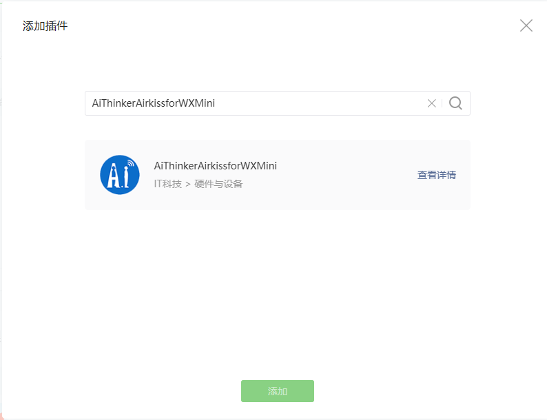
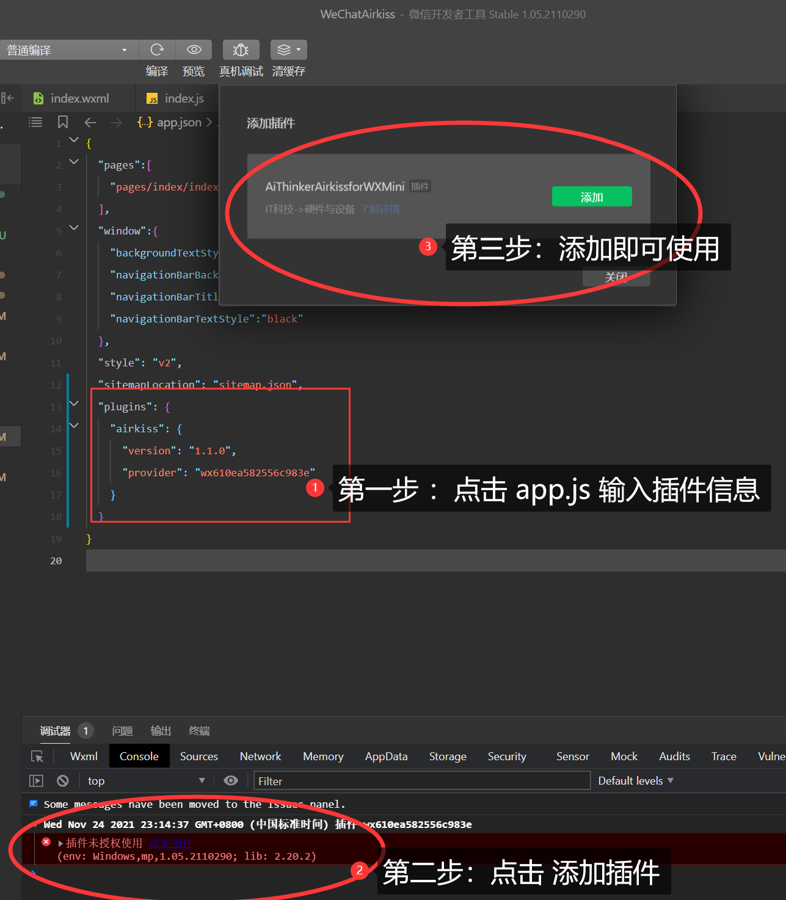

# 微信小程序 Airkiss 配网 [[微信硬件平台 (qq.com)](https://iot.weixin.qq.com/wiki/new/index.html?page=4-1-1)]

- 小程序使用Airkiss配网可考虑使用微信插件来进行实现 WeChatAirkiss [[AiThinkerAirkissforWXMini](https://mp.weixin.qq.com/wxopen/pluginbasicprofile?action=intro&appid=wx610ea582556c983e&token=2125284915&lang=zh_CN)]
- 

AirKiss是微信硬件平台为Wi-Fi设备提供的微信配网、局域网发现和局域网通讯的技术。开发者若要实现通过微信客户端对Wi-Fi设备配网、通过微信客户端在局域网发现Wi-Fi设备，或者把微信客户端内的音乐、图片、文件等消息通过局域网发送至Wi-Fi设备。

设备进入 Wi-Fi 混杂模式（promiscuous mode）以监听捕获周围的 Wi-Fi 报文。由于设备暂未联网，且 Wi-Fi 网络的数据帧已通过加密，设备无法获取 payload 的内容，但可以获取报文的某些特征数据，例如每个报文的长度，同时对于某些数据帧；例如 UDP 的广播包或多播包，其报文的帧头结构比较固定，较容易识别。

此时在手机 App 或者小程序侧，即可通过发送 UDP 的广播包或多播包，并利用报文的特征，例如长度变化进行编码。

将目标 Wi-Fi 路由器的 SSID/PSW 字符以约定的编码方式发送出去，设备端在捕获到 UDP 报文后，按约定的方式进行解码，即可得到目标 Wi-Fi 路由器的相关信息并进行联网。

## 使用方式

1. 添加插件
2. 在对应页面引入插件 **requirePlugin**(**'airkiss'**)
3. 调用api进行配网 airkiss.startAirkiss()

## 添加插件

打开 app.js 文件添加代码

```json
"plugins": {
  "airkiss": {
    "version": "1.1.0",
    "provider": "wx610ea582556c983e"
  }
}
```

根据提示添加插件，如果已经在小程序后台添加则不会有提示



## 在要进行配网功能的页面引入插件

```javascript
const airkiss = requirePlugin('airkiss');
//获取版本
console.log( airkiss.version)
```

## 使用 api 进行配网

### airkiss.startAirkiss(ssid,password,funtion())

开始配置，需要入参路由器的SSID、密码以及回调函数，出参说明见示例。

Note：请自行处理是否为2.4G频段路由器，以及密码是否正确。

### airkiss.stopAirkiss()

停止配置，释放配网线程的内存。

Note：建议在建议在页面 unload 等生命周期里面调用。

### airkiss.version

获取版本

## 代码参考

```javascript
const airkiss = requirePlugin('hello-plugin')

//这里最好加微信小程序判断账号密码是否为空，以及其长度和是否为5G频段
airkiss.startAirkiss(this.data.ssid, this.data.password, function (res) {
  switch (res.code) {
    case 0:
      wx.showModal({
        title: '初始化失败',
        content: res.result,
        showCancel: false,
        confirmText: '收到',
      })
      break
    case 1:
      wx.showModal({
        title: '配网成功',
        content: '设备IP：' + res.ip + '\r\n 设备Mac：' + res.bssid,
        showCancel: false,
        confirmText: '好的',
      })
      break
    case 2:
      wx.showModal({
        title: '配网失败',
        content: '请检查密码是否正确',
        showCancel: false,
        confirmText: '收到',
      })
      break

    default:
      break
  }
})

//停止配网，建议在页面 unload 等生命周期里面调用，释放线程
airkiss.stopAirkiss()
```
