# 微信开发者工具版本：

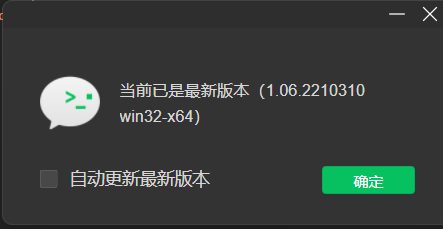

# 调试基础库:

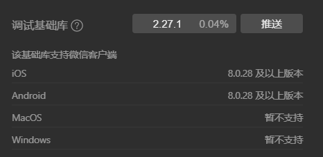

# 一、 注册小程序

- 1. 打开微信公众平台网站https://mp.weixin.qq.com/, 点击立即注册，进入页面选择小程序，按照要求注册及补充完整小程序资料
     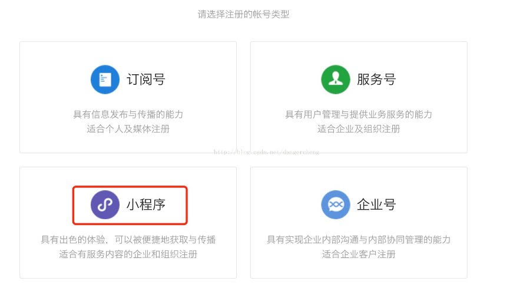
- 2. 配置小程序开发人员及补充完整资料
     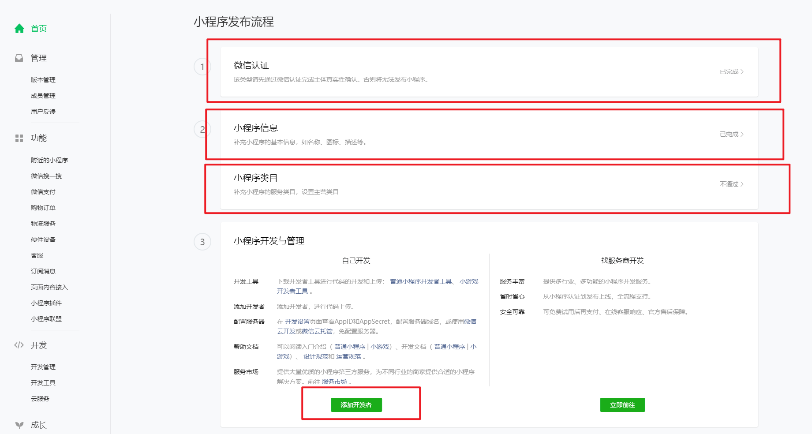

# 二、 开发小程序

- 1. 去官网下载最新的 IDE,，创建小程序项目，输入项目信息
- 2. 选择需要进行开发的账号
     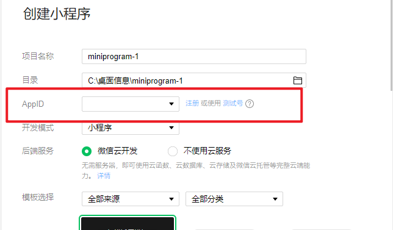
- 3. 开发完成后上传代码
     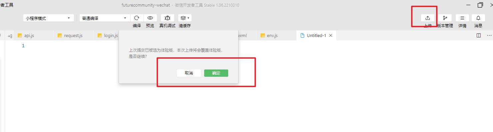

# 三、 域名配置

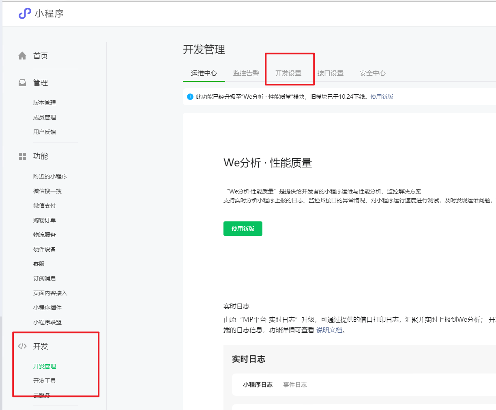

- 1. 微信需要使用 https 第一步配置域名 选择服务器域名->开始配置
     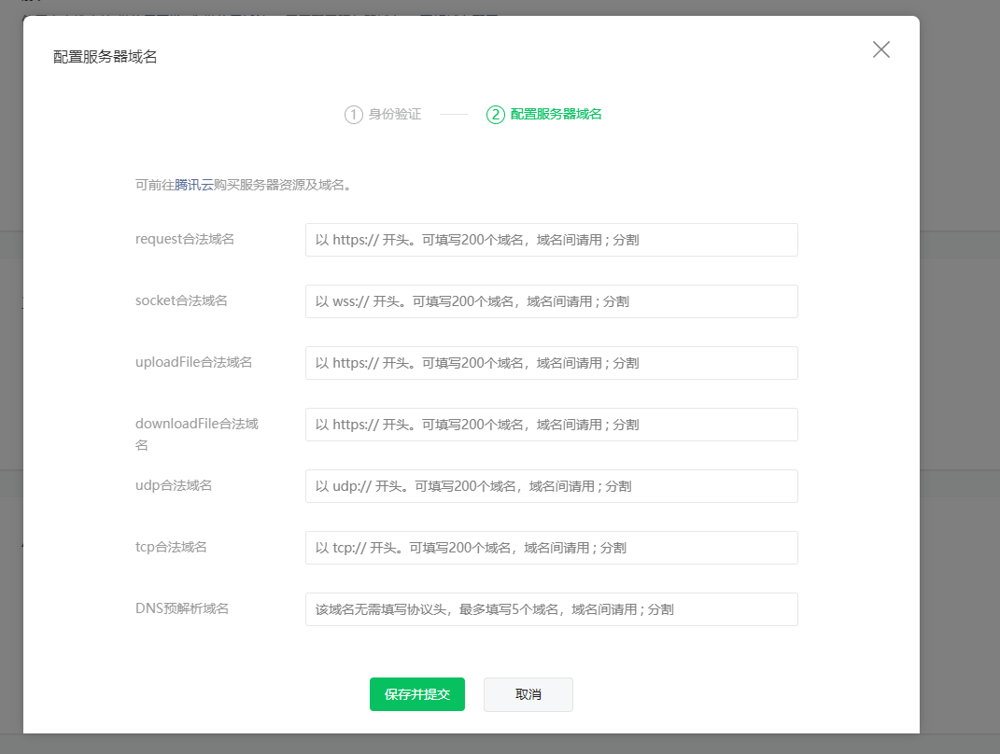
- 2. 页面涉及 `<web-view />` 需要配置业务域名 选择业务域名域名->开始配置
     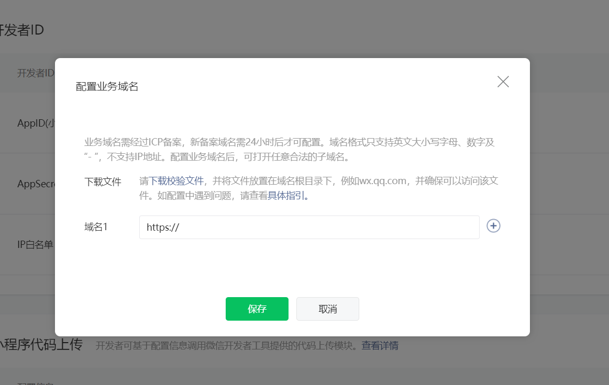
- 3. 涉及扫描普通二维码跳转小程序 需要配置配置扫普通链接二维码打开小程序 扫普通链接二维码打开小程序->添加
     

# 四、 发布体验版本

- 1. 上传代码后打开小程序主页 -点击提交审核旁边更多里面的开始体验
     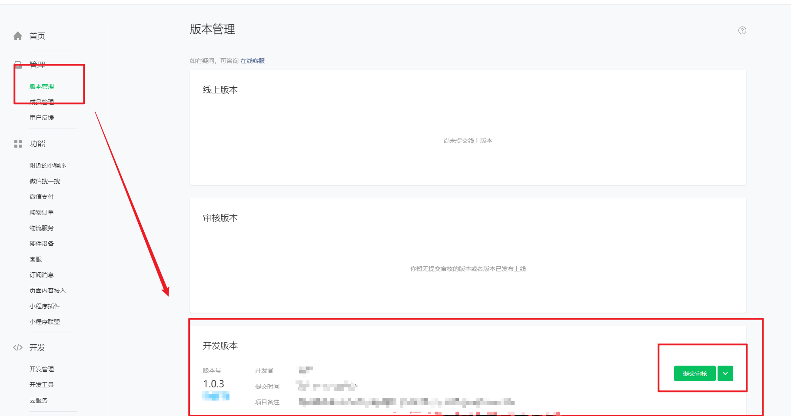
     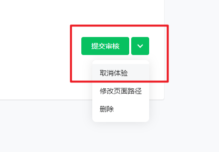

# 五、 发布线上版本

- 1-1. 发布线上版本需要先提交审核
  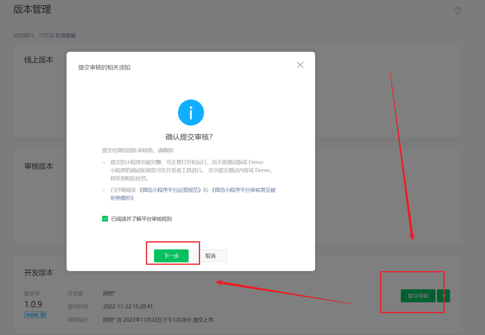
  1-2. 根据提示完善审核信息
  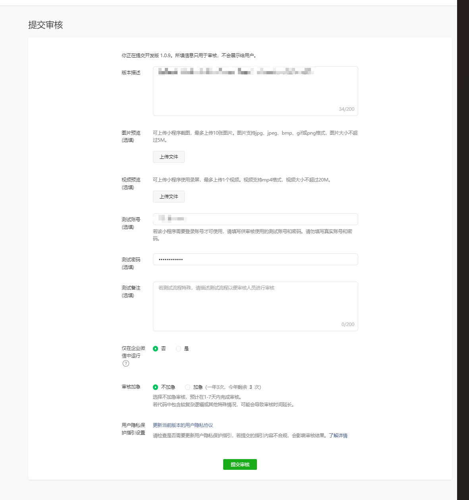
  1-3. 等待微信小程序审核
- 2-1. 提交发布线上
  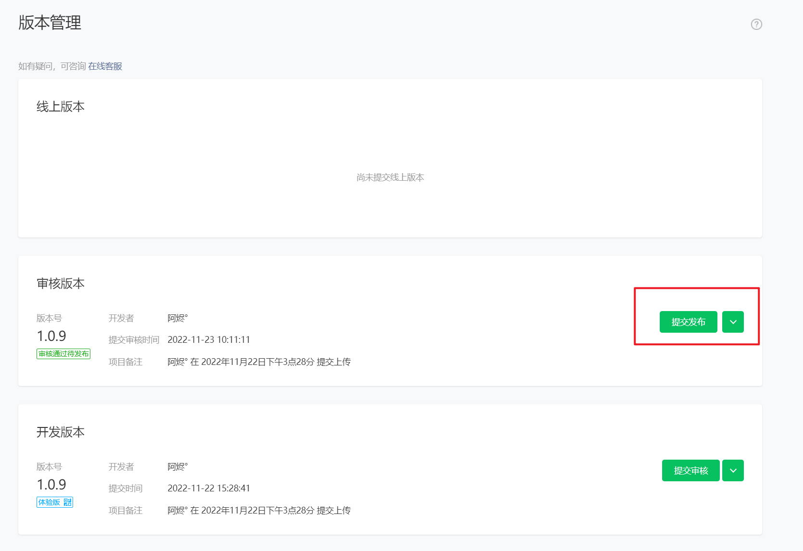
  2-2. 管理员扫码确认发布
  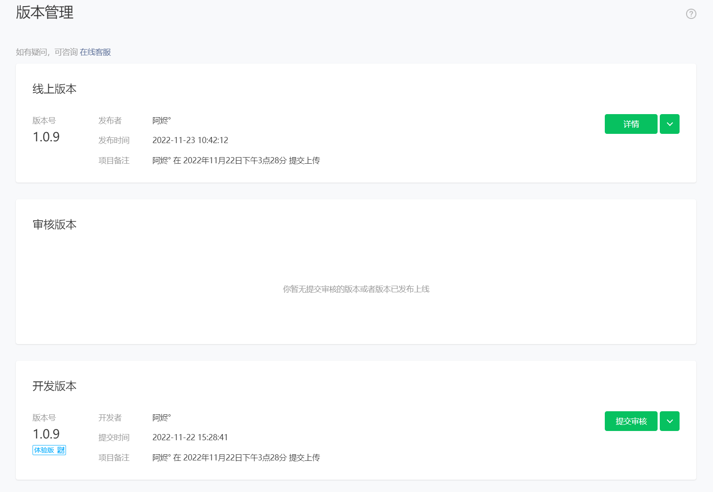
