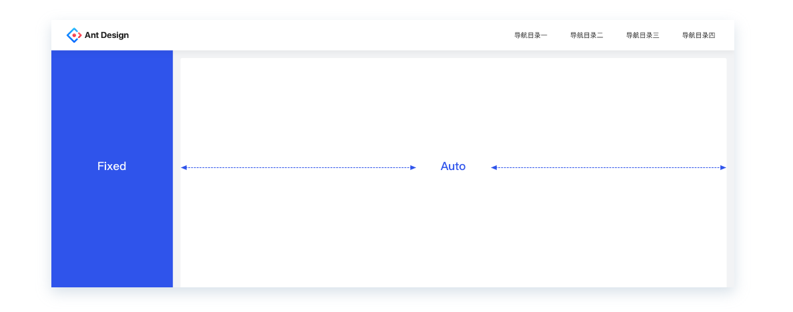
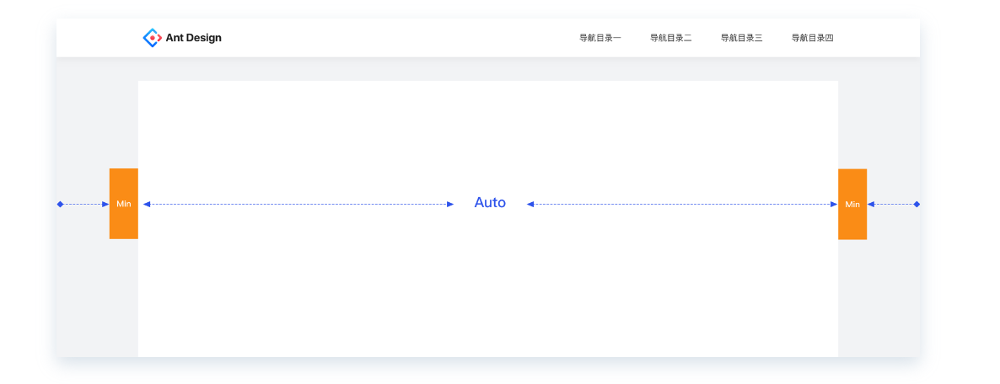
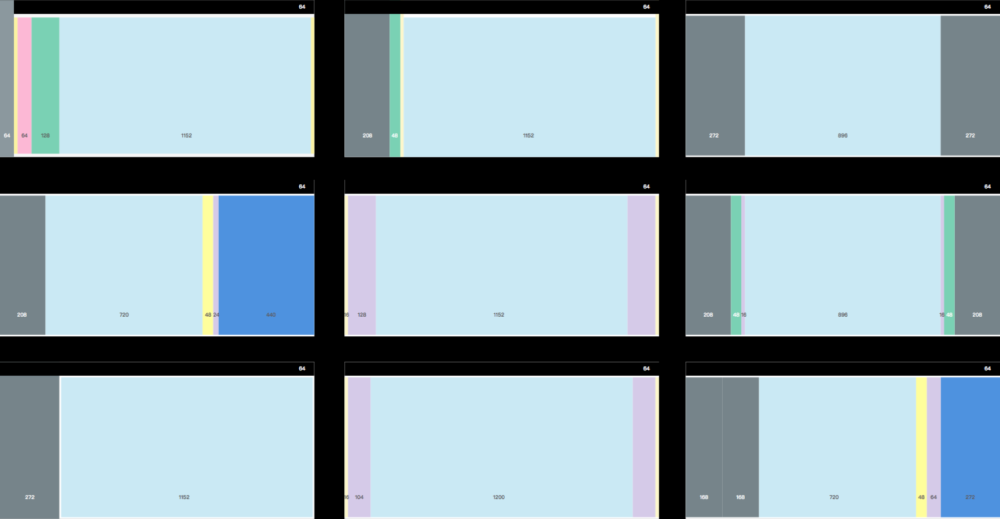

# Ant Design [[ant.design](https://ant.design/docs/spec/introduce-cn)]

蚂蚁集团的企业级产品是一个庞大且复杂的系统，数量多且功能复杂，而且变动和并发频繁，常常需要设计者与开发者能快速做出响应。同时这类产品中有存在很多类似的页面以及组件，可以通过抽象得到一些稳定且高复用性的内容。

## 设计价值观

基于「自然」、「确定性」、「意义感」、「生长性」四大[设计价值观](https://ant.design/docs/spec/values-cn)，通过模块化解决方案，降低冗余的生产成本，让设计者专注于更好的用户体验。

Ant Design 设计价值观为设计者提供评价设计好坏的内在标准，启示并激发了 Ant Design 设计原则和设计模式，进而为具体设计问题提供向导和一般解决方案。


### 「自然」

- **感知自然** ：认知心理学所述，约 80% 外界信息通过视觉通道获取。界面设计中最重要的视觉要素，包括布局、色彩、插画、图标等，应充分汲取自然界规律，从而降低用户认知成本，带来真实流畅的感受。在一些场景下，适时加入听觉、触觉等其它感知通道，能创造更丰富自然的产品体验。
- **行为自然** ：在与系统的互动中，设计者应充分理解用户、系统角色、任务目标间的关系，场景化组织系统功能和服务。同时辅以行为分析、人工智能、传感器、元数据等策略，提供主动式服务，帮助用户决策、减少操作，从而节约用户脑力和体力，让人机交互行为更自然。

> 想了解自然价值观的前世今生，[请移步至专栏](https://zhuanlan.zhihu.com/p/44809866)。

### 「确定性」

高确定性、低合作熵

- **设计者确定** ：通过探索设计规律、模块化设计思路，来为设计者提供足够精简的设计规则、组件、模式等，赋能设计者、降低合作熵。
  - 保持克制：完美不在于无以复加，而在于无可删减，万事莫不如此。
  - 面向对象的方法：探索设计规律，并将其抽象成「对象」，增强界面设计的灵活性和可维护性，同时也减少「设计者」的主观干扰，从而降低系统的不确定性。
  - 模块化设计：设计者可运用现有的组件/模板或者自行抽象可复用的组件/模板，节约无谓的设计且保持系统一致性，让「设计者」把创造力专注在最需要的地方。
- **用户确定** ：一致的外观和交互，保持面向用户的熟悉感，能提升易学性，降低认知和操作成本，提升工作效率。

### 「意义感」

一个产品或功能被创造出来更多是承载用户的某个工作使命。产品设计应充分促成用户使命的达成，兼顾用户的人性需求。

- **结果的意义：明确目标，即时反馈** 。洞悉工作目标，根据使用流程拆解明确的子目标，每个交互行为都围绕着主目标的达成；每个行为辅以恰当的反馈，让用户对操作结果了然于胸。
- **过程的意义：挑战适中，全情投入** 。调整不同场景下的工作难度，让功能适时适地触发，以匹配用户能力；如无必要，勿增实体，不分散用户注意力，让用户专注于任务达成，而非界面。

### 「生长性」

- **价值连接** ：设计者应建立系统设计思维，探索用户在不同场景下的需求，帮助用户建立更有效、更高效的工作方式。
- **人机共生** ：产品设计时，不应将用户和系统独立开来，应作为一个动态发展的共同体来思考，确保其足够的灵活、包容，充满生命力。

# 全局样式

## 色彩

Ant Design 将色彩体系解读成两个层面：系统级色彩体系和产品级色彩体系。

系统级色彩体系主要定义了蚂蚁中台设计中的基础色板、中性色板和数据可视化色板。产品级色彩体系则是在具体设计过程中，基于系统色彩进一步定义符合产品调性以及功能诉求的颜色。

## 布局

### 「统一画板」

为了尽可能减少沟通与理解的成本，有必要在组织内部统一设计板的尺寸。蚂蚁中台设计团队统一的画板尺寸为 1440。

### 「适配」

据统计，使用中台系统的用户的主流分辨率主要为 1920、1440 和 1366，个别系统还存在 1280 的显示设备。

#### 一、左右布局的适配方案

常被用于左右布局的设计方案中，常见的做法是将左边的导航栏固定，对右边的工作区域进行动态缩放。



#### 二、上下布局的适配方案

常被用于上下布局的设计方案中，做法是对两边留白区域进行最小值的定义，当留白区域到达限定值之后再对中间的主内容区域进行动态缩放。



### 「网格单位」

Ant Design 通过网格体系来实现视觉体系的秩序。网格的基数为 8，不仅符合偶数的思路同时能够匹配多数主流的显示设备。通过建立网格的思考方式，还能帮助设计者快速实现布局空间的设计决策同时也能简化设计到开发的沟通损耗。

### 「关于栅格」

Ant Design 采用 24 栅格体系。以上下布局的结构为例，对内容区域进行 24 栅格的划分设置，如下图所示。我们为页面中栅格的 Gutter 设定了定值，即浏览器在一定范围扩大或缩小，栅格的 Column 宽度会随之扩大或缩小，但 Gutter 的宽度值固定不变。


### 「常用模度」

蚂蚁中后台涵盖了大量的不同类型和量级的产品，为了帮助不同设计能力的设计者们在界面布局上的一致性和韵律感，统一设计到开发的布局语言，减少还原损耗，Ant Design 提出了 UI 模度的概念。在大量的实践中，我们提取了一组可以用于 UI 布局空间决策的数组，他们都保持了 8 倍数的原则、具备动态的韵律感。经过验证，可以在一定程度上帮助我们更快更好的实现布局空间上的设计决策。



### 「是启发，而非限制」

Ant Design 在布局空间上的成果并非要限制设计产出，更多的在于引导设计者如何做到「更好」。8 倍数的双数组通过排列组合的方式可以形成千变万化种可能性，但在无限的可能性之中依然存在着「只是简单的套用数据组合」同「看起来很精妙」的差别。实现合理优雅的界面布局，在对美感的追求之上，还应当结合可用性来看待，对于企业级应用界面布局的探索，我们依然在路上。

## 字体

字体是体系化界面设计中最基本的构成之一。

我们的用户通过文本来理解内容和完成工作，科学的字体系统将大大提升用户的阅读体验及工作效率。Ant Design 字体方案，是基于「动态秩序」的设计原则，结合了自然对数以及音律的规则得出的，再经过了大量的蚂蚁中后台产品验证之后，推荐给大家。在中后台视觉体系中定义字体系统，我们建议从下面五个方面出发：

1. 字体家族
2. 主字体
3. 字阶与行高
4. 字重
5. 字体颜色

### 「字体家族」

优秀的字体系统首先是要选择合适的字体家族。Ant Design 的字体家族中优先使用系统默认的界面字体，同时提供了一套利于屏显的备用字体库，来维护在不同平台以及浏览器的显示下，字体始终保持良好的易读性和可读性，体现了友好、稳定和专业的特性。

```css
@font-family: -apple-system, BlinkMacSystemFont, 'Segoe UI', Roboto, 'Helvetica Neue', Arial, 'Noto Sans', sans-serif, 'Apple Color Emoji', 'Segoe UI Emoji', 'Segoe UI Symbol',
  'Noto Color Emoji';
```

> 参考自 [https://www.smashingmagazine.com/2015/11/using-system-ui-fonts-practical-guide/](https://www.smashingmagazine.com/2015/11/using-system-ui-fonts-practical-guide/) 和 [http://markdotto.com/2018/02/07/github-system-fonts/](http://markdotto.com/2018/02/07/github-system-fonts/)

另外，在中后台系统中，数字经常需要进行纵向对比展示，我们单独将数字的字体 font-variant-numeric 设置为 `tabular-nums`，使其为等宽字体。
