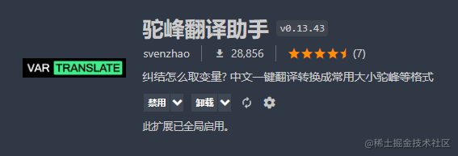
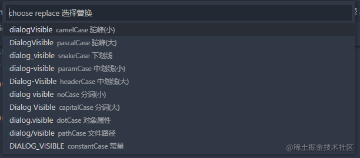
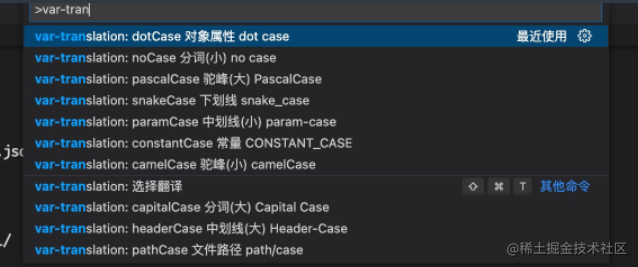

## 插件地址：[驼峰翻译助手](https://marketplace.visualstudio.com/items?itemName=svenzhao.var-translation)

纠结怎么取变量? 中文一键翻译转换成常用大小驼峰等格式
<br />
也可以英文一键转换成常用大小驼峰等格式



## 快捷键

```
win: "Alt+shift+t"
mac: "cmd+shift+t"
```



## 使用 `ctrl+shift+P`


