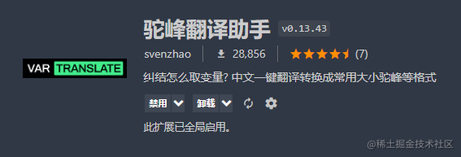
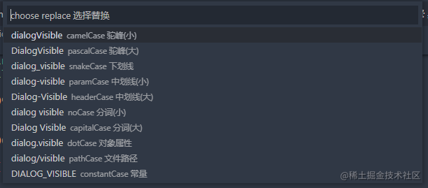
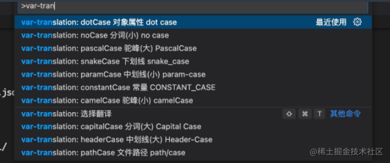

## 插件

[Var Translation 驼峰翻译助手](https://marketplace.visualstudio.com/items?itemName=svenzhao.var-translation) 可将**中文**或**英文**一键转为常用的大小驼峰、下划线、常量等格式。

也支持在英文间快速切换命名风格。



### 快捷键

```text
win: Alt+shift+t
mac: cmd+shift+t
```



### 命令面板（Ctrl+Shift+P）


