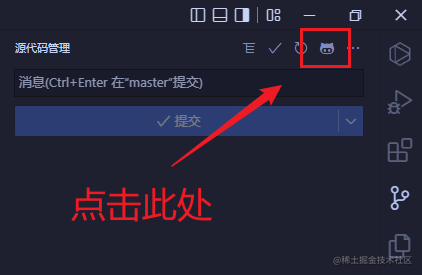
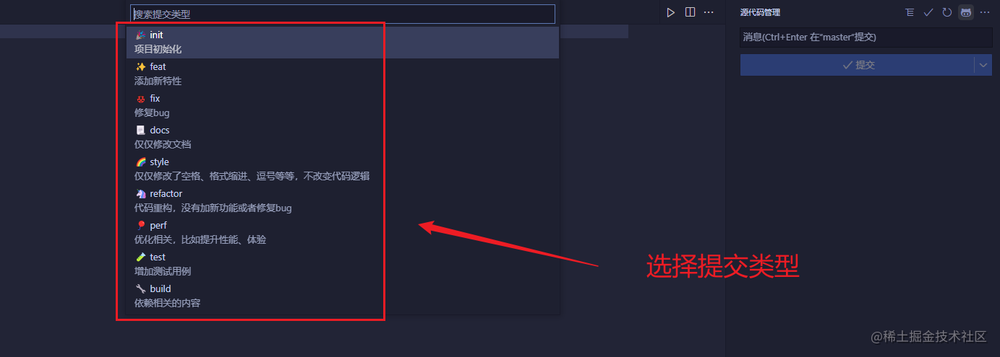
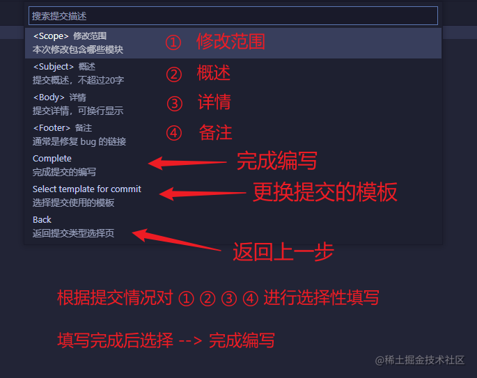
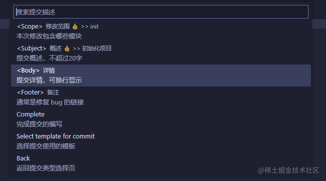

## 插件

[git-commit-plugin](https://marketplace.visualstudio.com/items?itemName=redjue.git-commit-plugin) 用于在提交时按步骤选择类型与说明，适合团队统一 commit 风格。

## 使用步骤

### 第一步：选择提交

### 第二步：选择提交类型

### 第三步：进行 commit 填写

选择对应选项后按 Enter，依提示填写内容，可多次重复。

### 第四步：完成并生成 commit 信息

