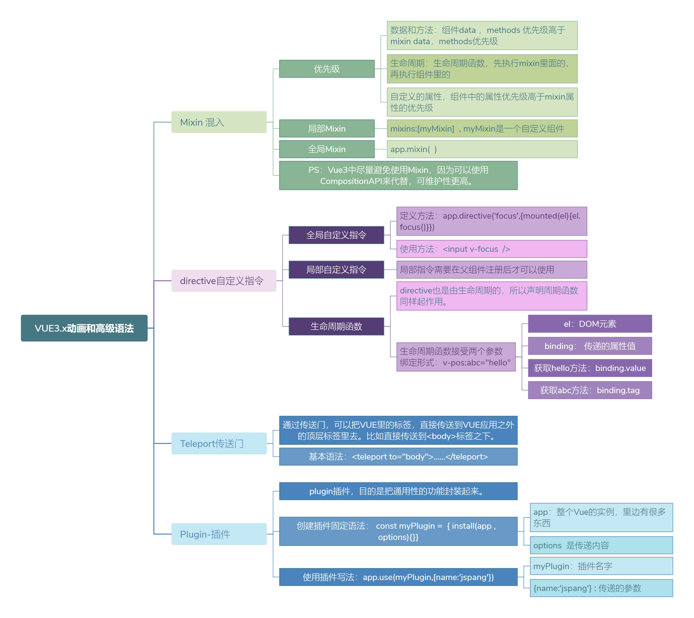

## 速查图：`ref()` 与 `reactive()`

速查图对比 `ref()` 与 `reactive()`：声明方式、`.value` 解包、以及 `reactive` 的解构与整体替换等限制。Vue 推荐以 **`ref` 作为声明响应式状态的主要方式**。

*图源：@icarus_gk*

## Vue 系列分图（PNG）

同一套内容的拆分大图，可按顺序查阅；在窄屏上比单张长图更易缩放阅读。

### 学前了解

### 基础知识

### 组件相关语法

### 高级语法（一）

### 高级语法（二）

### 配套工具

*图源：@jspang*
